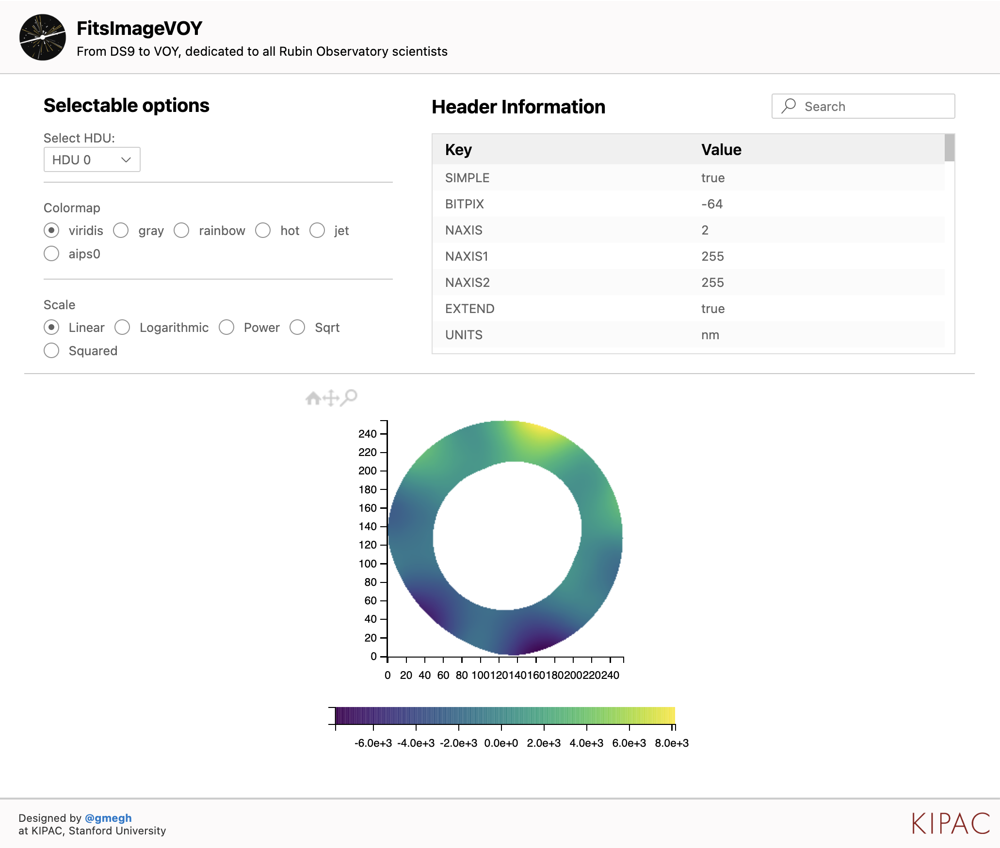

# FitsImageVOY for Visual Studio Code

**FitsImageVOY** is a Visual Studio Code extension designed for astronomers, astrophysicists, and enthusiasts interested in visualizing FITS (Flexible Image Transport System) files directly within the Visual Studio Code environment. This extension provides a lightweight yet powerful solution, serving as a scaled-down version of SAOImageDS9. 

Tired of loading FITS files in DS9 or jupyter notebooks? FitsImageVOY is the solution for you! FitsImageVOY provides a seamless and integrated environment for your astronomical data analysis.

## Features

- **Header Previewer:** View and explore the header information of FITS files for a comprehensive understanding of the data.

- **Search Function:** Easily locate specific information within the FITS file using the search function.

- **Colormap and Scale Selection:** Customize your viewing experience by selecting different colormaps and scales.

- **Image Visualization:** Visualize FITS images directly within Visual Studio Code, providing a seamless and integrated environment for your astronomical data analysis.

- **Zoom Functionality:** Zoom in on specific regions of the FITS image for detailed examination.

## About FitsImageVOY

The name FitsImageVOY refers to the Voyager series of Star Trek, the successor of DS9 (Deep Space Nine), after which SAOImageDS9 was named. DS9, a space station in the Star Trek universe, marked the beginning of a transformative journey into the cosmos. As the successor to DS9, the Voyager series continued this legacy, venturing into uncharted territories and inspiring generations of astronomers and space enthusiasts. SAOImageDS9, a powerful astronomical imaging tool, inherits its name from this iconic series. FitsImageVOY, drawing inspiration from SAOImageDS9, follows in the footsteps of DS9 and the Voyager series, contributing to the ongoing saga of cosmic exploration in the realm of data visualization for astronomers and researchers.

FitsImageVOY is dedicated to the Rubin observatory scientists who will discover the questions of the next 50 years. Learn more about the groundbreaking [Rubin Observatory](https://www.lsst.org/) project. 

**Developed at:** KIPAC, Stanford University

**Author:** Guillem Megias Homar ([gmegh](https://github.com/gmegh/))

## Attribution

FitsImageVOY makes use of the following libraries and tools:

- [mpld3](https://mpld3.github.io/): A library for D3.js visualizations of Matplotlib plots.
- [d3js](https://d3js.org/): A JavaScript library for producing dynamic, interactive data visualizations.
- [Matplotlib](https://matplotlib.org/): A comprehensive library for creating static, animated, and interactive visualizations in Python.
- [Astropy](https://www.astropy.org/): A community-developed library for astronomy in Python.

## Next Steps

We're committed to continuously enhancing FitsImageVOY. Here are some planned improvements:

#### Copy to Clipboard

Copy relevant information or visualizations to the clipboard for easy sharing or further analysis.

#### Enhanced Visualization Options

Explore additional visualization options to enhance your experience with FITS files in Visual Studio Code.

Feel free to contribute or share your ideas by [contacting the author](https://github.com/gmegh/).

## Installation

For installation instructions and more details, please refer to the [Visual Studio Code Marketplace](https://marketplace.visualstudio.com/items/your-extension-name).

Enjoy exploring the cosmos with FitsImageVOY! 🌌🔭